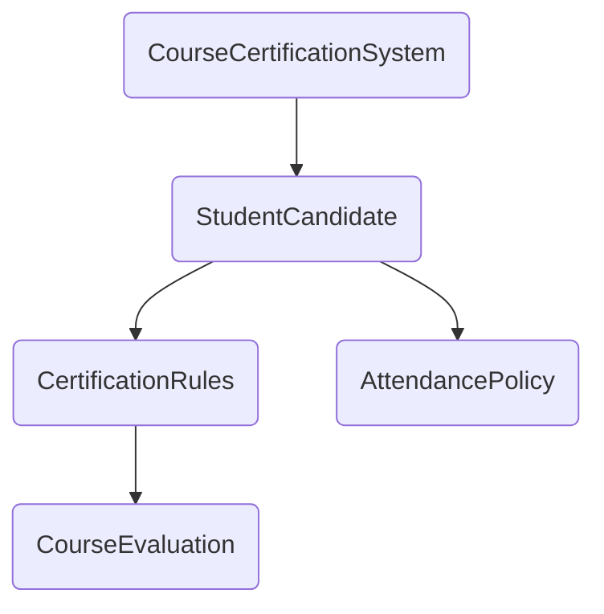

## Course Certification System

A simple course certification system, that takes user input and returns report card of student. 


File Structure
| File Name        | Type      | Use                                                                                           | Extends/Implements    |
| ---------------- | --------- | --------------------------------------------------------------------------------------------- | --- |
| AttendancePolicy | Interface | Declares functions pertaining to student attendance: **readAttendance(), isAttendanceEligible()** | -    |
| CourseEvaluation | Interface | Declares functions pertaining to student marks: **readMarks(), calculateGrade()**                                                |  -   |
|   CertificationRules               |  Interface         |                                                                                 Declares methods pertaining to student certification eligibility: i**sMarksEligible()**              |   Extends: CourseEvaluation |
|       StudentCandidate           |   Class        |     Main engine, contains all methods concrete implementation, defines new methods: **readStudentId(), readStudentDetails(), checkEligibility(), displayResult()**|Implements: CertificationRules, AttendancePolicy
|CourseCertificationSystem |Main File|Runs the entire program, makes an object of /StudentCandidate and executes method calls|Uses: StudentCandidate




#### Main Execution Engine
```java
//CourseCertificationSystem.java
public class CourseCertificationSystem
{
    public static void main(String args[]){
        StudentCandidate student = new StudentCandidate();
        student.readStudentDetails();
        student.calculateGrade();
        student.displayResult();
    }
}
```

### How to run:
1. Run void main(String args[]) of CourseCertificationSystem
2. Enter Student Details
    a. Student Id (String)
    b. Marks(int)
    c. Attendance(int)
    
    
    //Sample Values
    
3. Analyse Output:
    //Sample Values
    


